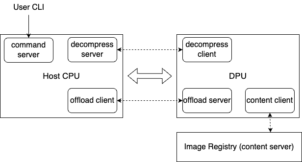

# Poby Artifact Instructions

## Overview

There are 3 components in this code:
- A prototype of a RDMA-based image registry for storing container images (`src/host/server/content_server.cc`)
- A prototype of Poby that consists of two parts: one running on the host CPU (`src/host/client/client_main.cc`) and another running on the DPU (`src/dpu/dpu_main.cc`)
- A prototype of CLI to simulate user requests for pulling container images

### Image registry

The image registry is used to store container images.
It supports transfering images by RDMA network and storing images in chunks that can be decompressed by Poby.

### Poby

Poby is a software-hardware collaborative system that offloads and accelerates critical operations of image provisioning using SmartNICs. 
It contains two parts: a program running on host CPU  and a program running on DPU.

#### Host CPU

The host CPU side is responsible for:
- receiving user requests for pulling images
- notify the DPU side to start image provision pipeline
- after the DPU side decompresses the image blocks, the host CPU unpacks the blocks and writes them to the file-system for image provision

#### DPU

The DPU side is responsible for:
- read image blocks from the remote registry by RDMA network
- decompress the image blocks by a specific hardware accelerator
- transfer data to host CPU side by DMA engine


For more details about Poby's design, please refer to our paper.

# Set up the environment

## Hardware dependency

The experimental environment requires at least 2 machines. 
- Machine A must be equipped with an NVIDIA BlueField-2 SmartNIC with a pre-installed image that supports [DOCA 2.0.2](https://docs.nvidia.com/doca/archive/doca-v2.0.2/release-notes/index.html).
Machine A will run Poby to accelerate image downloads.
- Machine B simulates a centralized image registry. It must be equipped with at least one RDMA NIC to enable RDMA network connection with Machine A.


## Software dependencies

We use Ubuntu 22.04.2 LTS as the operating system on the CPU host.


- Install common dependencies

```shell
sudo apt-get install -y libhttp-parser-dev curl libcurl4-gnutls-dev libdevmapper-dev libcap-dev libyajl-dev 
sudo apt-get install -y git g++ make libssl-dev libgflags-dev libprotobuf-dev libprotoc-dev protobuf-compiler libleveldb-dev
```

- Install vcpkg

We recommend using vcpkg to install C++ libraries.

```shell
sudo wget -O vcpkg.tar.gz https://github.com/microsoft/vcpkg/archive/master.tar.gz
sudo mkdir /opt/vcpkg
sudo tar xf vcpkg-master.tar.gz --strip-components=1 -C /opt/vcpkg
sudo /opt/vcpkg/bootstrap-vcpkg.sh
sudo ln -s /opt/vcpkg/vcpkg /usr/local/bin/vcpkg
```
- Install C++ libraries.

```shell
sudo -E vcpkg install spdlog
sudo -E vcpkg install tl-expected
sudo -E vcpkg install libarchive
```

## Build Poby

```shell
cmake --preset release # could change to "cmake --preset debug" for debug
cmake --build build 
# the first compile of isulad may cause error. You can rerun commands to solve it.
cmake --preset release
cmake --build build 
```

# Run Poby

## Perparation

### Set environment variables

Before running Poby, you need to modify `scripts/set_env.sh` to change IP address, ports and RDMA device names according to your own environments.

The following figure shows the deployment locations of each component:



All the scripts are need to be executed on the host CPU of Machine A.

Since the script will use SSH to log into the DPU and Machine B, you need to first configure SSH in `~/.ssh/config`. Here is an example:
```
Host content_server
  HostName 10.16.0.184
  User alice
  Port 22

Host dpu 
  HostName 192.168.100.2
  User ubuntu
  Port 22
```
Here `content_server` represents Machine B, and `dpu` represents the DPU of Machine A.

### Prepare for image blocks

In order to run Poby, we need to split and compress the image files into image blocks which can be parsed by Poby.

The preparation for image blocks can be broken down into three steps:
- Get the original image files
- Decompress the original image files
- Split and ompress those decompressed image files into image blocks that can be parsed by Poby


``` shell
# get the original image files
./tool/get_image_data.sh --download-dir ./data/image_raw

# decompress image files
sudo python3 ./tool/gen_uncompressed_layers.py  \
    --input-path ./data/image_raw \
    --output-path ./data/uncompress

# split and compress
sudo ./build/tool/image_compress \
    -input_floader ./data/uncompress \
   -output_folder ./data/registry/content_layers_32m \
   -segment_size 33554432
```

Those image blocks should be stored in Machine B as the resources of the image layers.

### Perpare for image configs

Poby needs to query some configuration files to determine which layers make up an image. Therefore, we need to save these configuration files on Machine A.

```shell

python3 ./tool/copy_metadata.py --input-path ./data/image_raw --output-path ./data/metadata
```


## End to end performance

## Artifact Evaluation

We select the [e2e performance](./docs/e2e-performance.md) evaluation experiment as the AE for two main reasons:

1. This experiment can substantiate our key claim that Poby outperforms two industry-standard container platforms, containerd and iSulad, by 13.2x and 8.0x, respectively.

2. The e2e performance experiment serves as the foundation for all experiments presented in the paper, encompassing the complete usage workflow of Poby. This makes it easy for anyone to verify the results of other experiments based on the e2e experiment.


## Other experiments

* [Concurrency](./docs/Concurrency.md)
* [CPU overhead measurement](./docs/CPU-overhead.md)
* [Memory configuration](./docs/Memory-configuration.md)